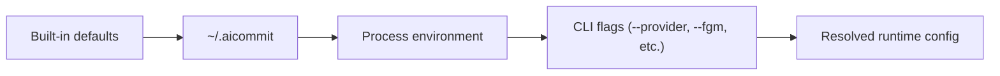

# Configuration

`aic` reads configuration in this order:

1. Built-in defaults
2. Global config at `~/.aicommit`
3. Process environment variables



Set global values:

```sh
aic config set AIC_API_KEY=<key> AIC_MODEL=gpt-5.4-mini
```

Read values:

```sh
aic config get AIC_MODEL AIC_AI_PROVIDER
```

Describe settings:

```sh
aic config describe
aic config describe AIC_MODEL
```

You can also inspect the config subcommands directly:

```sh
aic config --help
aic config set --help
aic config get --help
aic config describe --help
```

`aic config describe` uses the same shared config-key descriptions as the CLI help metadata, so the wording stays aligned across help output, completions, and the config reference commands.

Supported v1 keys:

```text
AIC_AI_PROVIDER
AIC_API_KEY
AIC_API_URL
AIC_API_CUSTOM_HEADERS
AIC_PROXY
AIC_TOKENS_MAX_INPUT
AIC_TOKENS_MAX_OUTPUT
AIC_HTTP_TIMEOUT
AIC_DESCRIPTION
AIC_EMOJI
AIC_MODEL
AIC_LANGUAGE
AIC_MESSAGE_TEMPLATE_PLACEHOLDER
AIC_PROMPT_FILE
AIC_ONE_LINE_COMMIT
AIC_OMIT_SCOPE
AIC_GITPUSH
AIC_REMOTE_ICON_STYLE
AIC_HOOK_AUTO_UNCOMMENT
```

`AIC_TOKENS_MAX_INPUT` defaults to `128000` for new configs.

`AIC_HTTP_TIMEOUT` caps each API request to the HTTP providers (`openai`, `azure-openai`, `anthropic`, `groq`, `ollama`) in seconds. It defaults to `120`; set it to `0` to disable the timeout entirely, or raise it if a slow local model (for example Ollama on a large prompt) needs more time. Local CLI providers (`claude-code`, `codex`, `copilot`) are not affected.

## Large diffs

When the staged diff exceeds the input token budget (`AIC_TOKENS_MAX_INPUT` minus `AIC_TOKENS_MAX_OUTPUT` and prompt overhead), `aic`, `aic review`, and `aic pr` split the diff into chunks, summarize each chunk with its own AI request, and synthesize the partial summaries into one final result. The spinner reports each stage (`Summarizing chunk 2/4`, `Synthesizing commit message`) so long runs are visibly progressing.

Each chunk costs one AI request, so very large diffs take proportionally longer. To keep diffs small, exclude bulky generated files from AI input with `.aicommitignore` (see the Prompt Template section below), and note that lockfiles and common image formats are already filtered out of the staged diff automatically.

While a generation runs, the spinner rotates through short status lines alongside the current stage. The built-in lines live in `src/status_messages.toml`; create `~/.aicommit-status.toml` with the same structure to replace any section with your own (sections you omit keep the defaults):

```toml
[waiting]
messages = ["contemplating the diff", "..."]

[rare]
messages = ["asking git to be reasonable"]
```

Example one-off environment override:

```sh
AIC_MODEL=gpt-5.4-mini aic
```

`aic` intentionally does not read local `.env` files. Project `.env` files often contain unrelated application secrets, cookies, or service credentials, so configuration should be set with `aic config set` or explicit process environment variables instead.

`AIC_DESCRIPTION` and `AIC_EMOJI` default to `true` for new configs.

For Azure OpenAI, set `AIC_AI_PROVIDER=azure-openai`, set `AIC_API_URL` to your Azure OpenAI v1 endpoint, and use your deployment name as `AIC_MODEL`.

For Anthropic, set `AIC_AI_PROVIDER=anthropic` and `AIC_API_KEY`, then optionally override the default `claude-sonnet-4-20250514` model with `AIC_MODEL`.

For Groq, set `AIC_AI_PROVIDER=groq` and `AIC_API_KEY`, then optionally override the default `llama-3.1-8b-instant` model with `AIC_MODEL`.

For Ollama, set `AIC_AI_PROVIDER=ollama` and optionally override the default `llama3.2` model with `AIC_MODEL`. `AIC_API_KEY` is not required for the default local Ollama server.

For local CLI providers, set `AIC_AI_PROVIDER=claude-code`, `AIC_AI_PROVIDER=codex`, or `AIC_AI_PROVIDER=copilot` and leave `AIC_MODEL=default`. These providers use the installed `claude`, `codex`, or `copilot` binary from `PATH` and rely on that CLI's existing login state instead of `AIC_API_KEY`.

Use `--provider <name>` to override the configured provider for a single run:

```sh
aic --provider anthropic
aic review --provider groq
aic --provider ollama
aic --provider claude-code
aic review --provider codex
aic review --provider copilot
aic log --provider codex --yes
aic models --provider ollama
```

The alias `claudecode` is accepted and normalized to `claude-code`.

`AIC_GITPUSH` controls whether `aic` offers a push step after committing. In the normal interactive flow, the single-remote prompt now defaults to `Yes`. With `aic --yes`, `aic` pushes automatically when exactly one remote is configured.

When `AIC_GITPUSH=true`, `aic` now fetches the tracked upstream before starting a push-enabled commit session. If the current branch is behind or has diverged from its upstream, `aic` stops before creating a new commit, shows Git-aware recovery guidance, and asks you to sync the branch first. Git remains the source of truth for the check; AI is only used to explain the safest next step.

`AIC_REMOTE_ICON_STYLE` controls Git host icons in push prompts. Use `auto` or `nerd-font` for Nerd Font icons with emoji and label fallback, `emoji` for emoji with label fallback, or `label` for plain provider labels only.

## Prompt Template

The default system prompt template lives at `prompts/commit-system.md`.

Use a custom prompt template without recompiling:

```sh
aic config set AIC_PROMPT_FILE=/absolute/path/to/commit-system.md
```

Prompt templates can use these placeholders:

```text
{{commit_convention}}
{{body_instruction}}
{{line_mode_instruction}}
{{scope_instruction}}
{{style_examples}}
{{language}}
{{context_instruction}}
```

`.aicommitignore` inherits all rules from `.gitignore` automatically. You only need to create `.aicommitignore` for *additional* exclusions on top of your existing `.gitignore`:

```ignorelang
# .aicommitignore — extra exclusions beyond .gitignore
path/to/large-asset.zip
**/*.jpg
```

If neither `.gitignore` nor `.aicommitignore` exists, no files are excluded.
