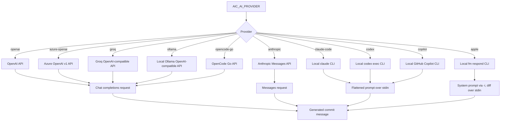

# Providers

V1 ships with these provider paths:

```text
openai
azure-openai
anthropic
groq
ollama
opencode-go
claude-code
codex
copilot
apple
```

`openai`, `azure-openai`, `groq`, `ollama`, and `opencode-go` use the OpenAI chat-completions wire format.

`anthropic` uses Anthropic's Messages API directly.

`claude-code`, `codex`, and `copilot` are experimental local-binary providers. They use the installed `claude`, `codex`, and `copilot` CLIs from your `PATH`, so authentication is managed by those tools rather than `aic`.

`apple` is an experimental local-binary provider for Apple's on-device Foundation Model. It runs the `fm respond` CLI that ships with macOS, so nothing leaves the machine and no API key is needed.

`opencode-go` is the OpenCode Go gateway (`https://opencode.ai/zen/go/v1`), a hosted catalog of open coding models. `aic` sends the per-conversation `x-opencode-session` header the gateway requires, so no wrapper script or `AIC_API_CUSTOM_HEADERS` injection is needed. Not every Go model is reachable: only the ones served by the `/chat/completions` endpoint work, because `aic` does not speak the `/responses` or `/messages` wire formats. `aic models --provider opencode-go` lists the gateway's full live catalog, including models on those other endpoints, so treat it as a lookup rather than a list of usable choices; `glm-5.3-flash` and the other `gpt`-free open models such as `kimi-k3`, `deepseek-v4-pro`, and `mimo-v2.6-flash` are known to work.

The session id is a fresh UUID generated once per `aic` process, so each run is a new conversation. Reusing one id across runs makes the gateway serve stale cached responses for identical prompts, which surfaces as `AI provider returned an empty response`. Set your own `x-opencode-session` header in `AIC_API_CUSTOM_HEADERS` to pin an id deliberately; your value wins over the generated one.



Configure OpenAI:

```sh
aic config set AIC_AI_PROVIDER=openai AIC_API_KEY=<key> AIC_MODEL=gpt-5.4-mini
```

The default OpenAI model is `gpt-5.4-mini`, the cost-efficient GPT-5.4 variant.

Use a custom compatible endpoint:

```sh
aic config set AIC_AI_PROVIDER=openai AIC_API_URL=https://example.com/v1
```

This existing `openai` + `AIC_API_URL` path remains the catch-all way to use other compatible endpoints when you do not want a dedicated provider preset.

Configure Azure OpenAI:

```sh
aic config set AIC_AI_PROVIDER=azure-openai AIC_API_KEY=<key> AIC_API_URL=https://<resource>.openai.azure.com/openai/v1 AIC_MODEL=<deployment-name>
```

For Azure OpenAI, `AIC_MODEL` is the deployment name used by your Azure OpenAI resource. `AIC_API_URL` must point at the Azure OpenAI v1 base URL.

Configure Anthropic:

```sh
aic config set AIC_AI_PROVIDER=anthropic AIC_API_KEY=<key> AIC_MODEL=claude-sonnet-4-20250514
```

Anthropic defaults to `https://api.anthropic.com/v1`. Override `AIC_API_URL` only if you need a proxy or gateway in front of the Anthropic API.

Configure Groq:

```sh
aic config set AIC_AI_PROVIDER=groq AIC_API_KEY=<key> AIC_MODEL=llama-3.1-8b-instant
```

Groq defaults to `https://api.groq.com/openai/v1` and uses the same chat-completions flow as other OpenAI-compatible providers.

Configure Ollama:

```sh
aic config set AIC_AI_PROVIDER=ollama AIC_MODEL=llama3.2
```

Ollama defaults to `http://localhost:11434/v1` and does not require `AIC_API_KEY`. Override `AIC_API_URL` if your Ollama server is running on another host or port.

Configure OpenCode Go:

```sh
aic config set AIC_AI_PROVIDER=opencode-go AIC_API_KEY=<key> AIC_MODEL=glm-5.3-flash
```

OpenCode Go defaults to `https://opencode.ai/zen/go/v1` and the `glm-5.3-flash` model. Subscribe to OpenCode Go in the [OpenCode Console](https://opencode.ai/auth) to get an API key.

Configure Claude Code:

```sh
aic config set AIC_AI_PROVIDER=claude-code AIC_MODEL=default
```

Configure Codex:

```sh
aic config set AIC_AI_PROVIDER=codex AIC_MODEL=default
```

Configure GitHub Copilot CLI:

```sh
aic config set AIC_AI_PROVIDER=copilot AIC_MODEL=default
```

Configure Apple Foundation Models:

```sh
aic config set AIC_AI_PROVIDER=apple AIC_MODEL=default
```

The `apple` provider needs a Mac with Apple Intelligence enabled and the `fm` CLI on `PATH`; run `fm available` to check the model is ready. `aic` calls `fm respond --no-stream --greedy --guardrails permissive-content-transformations`, passing the system prompt and few-shot example through `-i` and only the staged diff over stdin. The alias `fm` is accepted and normalized to `apple`.

The on-device model has an 8,192-token context window, so `aic` caps `AIC_TOKENS_MAX_INPUT` at `6000` for this provider (a lower configured value is kept). Larger diffs are split into chunks and synthesized as usual, which works but takes longer, and summaries of big multi-chunk diffs are noticeably less accurate than hosted models. It is best suited to small, focused commits. If the model still runs out of context, `aic` says so and suggests lowering `AIC_TOKENS_MAX_INPUT`.

Because the on-device model is small, commit generation with `apple` adjusts the prompt and output:

- It uses the compact `prompts/commit-system-apple.md` template, which leaves out the default style examples (the model tends to copy them) and tells the model not to restate the contents of added files as changes.
- The diff starts with a staged-file outline (added or modified, with line counts), and added prose files (`.md`, `.mdx`, `.txt` and similar) longer than 40 lines are trimmed to their first 20 lines, so a new blog post or README doesn't drown out the rest of the change.
- The generated message is tidied: stray code fences, Markdown bold, and trailing spaces are removed, a blank line is enforced between subject and body, and a GitMoji that contradicts the commit type (such as `✨ docs:`) is corrected when the short GitMoji convention is in use.

For local CLI providers, `AIC_MODEL=default` means "use the CLI's own default model". `aic` does not pass a model flag through in v1.

Use `--provider` to override the configured provider for a single run:

```sh
aic --provider anthropic
aic review --provider groq
aic --provider ollama
aic --provider claude-code
aic review --provider codex
aic review --provider copilot
aic --provider apple
aic log --provider codex --yes
aic models --provider ollama
```

The alias `claudecode` is accepted and normalized to `claude-code`, and `fm` is normalized to `apple`.

List cached or fallback models:

```sh
aic models
aic models --refresh
aic models --provider anthropic
aic models --provider groq
aic models --provider ollama
aic models --provider azure-openai
aic models --provider claude-code
aic models --provider opencode-go
aic models --provider copilot
aic models --provider apple
```

API-provider model responses are cached at `~/.aicommit-models.json` with a 7-day TTL. Local CLI providers report the static `default` model and a note about the installed binary instead of calling a remote models endpoint.
